# PwnyBolty — Technical Wiki

PwnyBolty has two payload modes. Both deliver via **ClickOnce** and use **AppDomainManager hijacking** to load a custom DLL into a Microsoft-signed binary — no admin rights, no custom signing required.

| Mode | What it does |
|------|-------------|
| **CFCO** (ClickForClickOnce) | Executes shellcode, drops files, or runs OS commands on the target |
| **Bolthole** | Establishes a persistent reverse SSH tunnel back to your C2 server |

---

## System Architecture

One Docker container runs everything. Caddy handles the web UI and file serving; the FastAPI backend manages builds in the background.

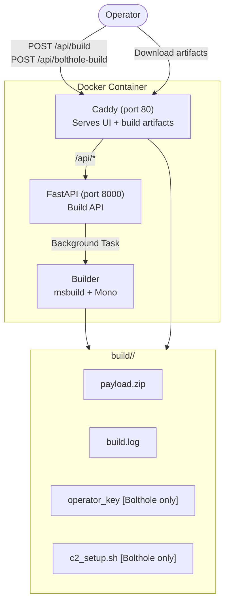

---

## Mode 1 — CFCO (ClickForClickOnce)

### UI Overview

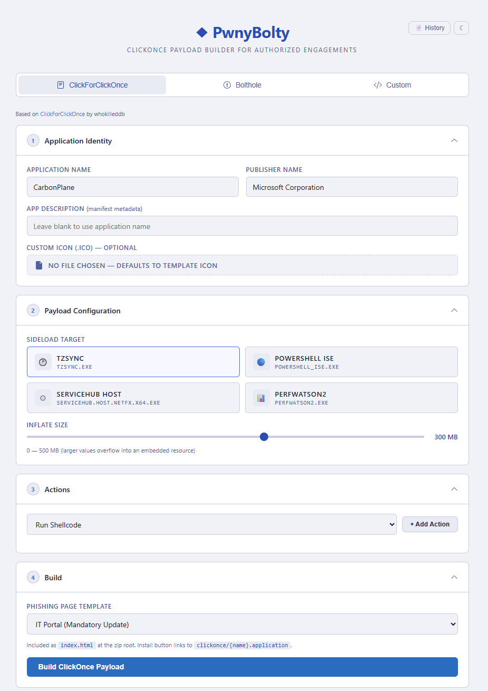

Fill in the four sections from top to bottom, then click **Build ClickOnce Payload**:

| Section | What to configure |
|---------|------------------|
| **1 Application Identity** | Application name, publisher name, optional description, optional `.ico` icon |
| **2 Payload Configuration** | Sideload target binary; inflate size (0–500 MB) to push past EDR size-scan thresholds |
| **3 Actions** | One or more actions (Run Shellcode / OS Command / File Drop) executed on the target |
| **4 Build** | Phishing page template; click **Build ClickOnce Payload** to kick off the background build |

### What happens on the server (build phase)

The operator submits a build request. The API returns a `buildid` immediately and compiles the payload in the background.

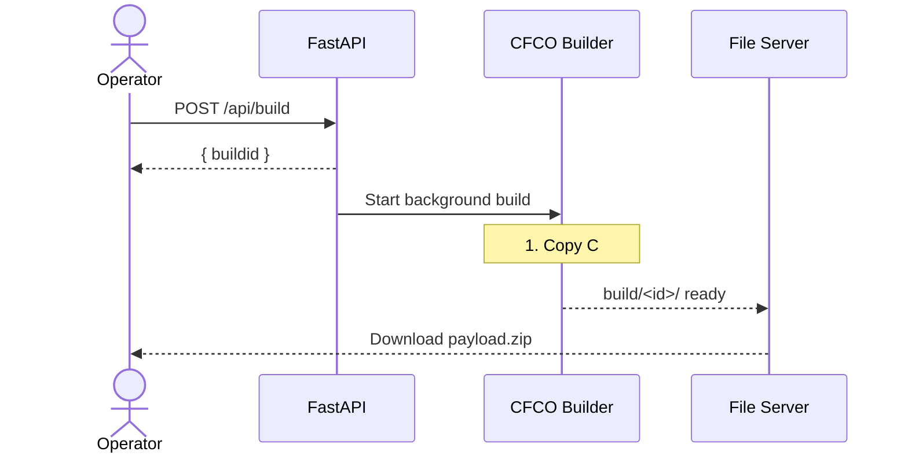

### What happens on the target (execution phase)

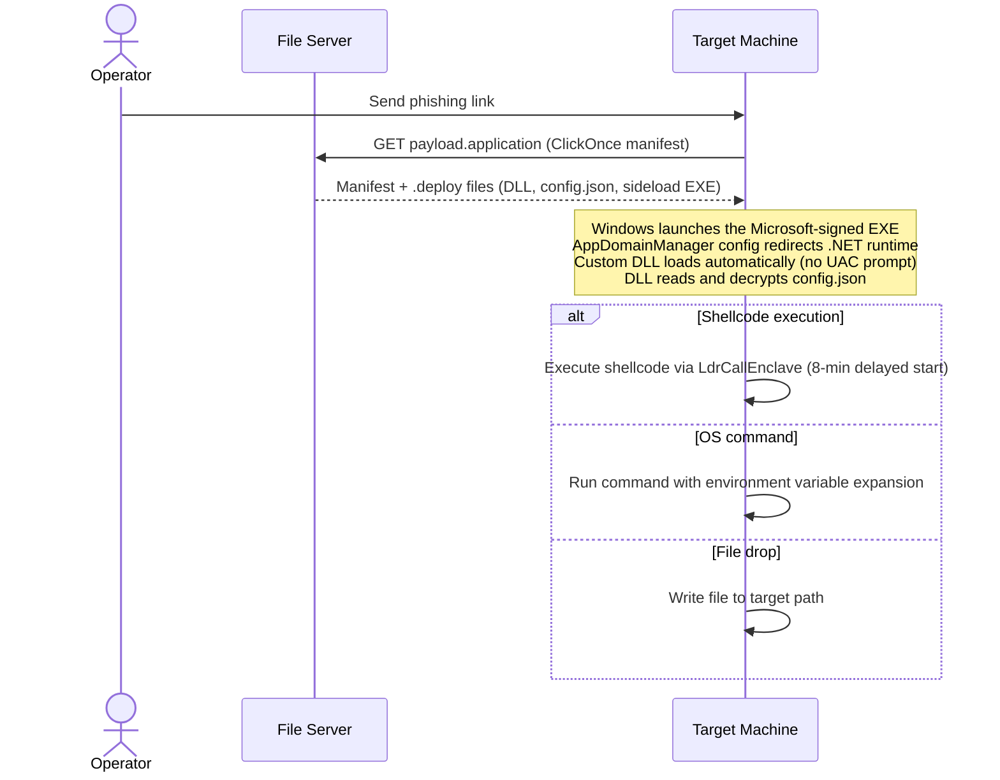

**Sideload targets** (all Microsoft-signed):

| Name | Binary |
|------|--------|
| `tzsync` | tzsync.exe |
| `perfwatson2` | PerfWatson2.exe |
| `systemhost` | ServiceHub.Host.netfx.x64.exe |
| `powershell` | powershell_ise.exe |

---

## Mode 2 — Bolthole (Reverse SSH Tunnel)

### Overview

Bolthole bundles a miniature SSH daemon (`sshd`) and SSH client (`ssh`) inside the ClickOnce package. Once the target runs the payload, it calls home through common firewall-allowed ports (443, 80, 22 …) and establishes a reverse tunnel back to your C2 server. The operator then SSHes into the tunnel and gets a shell — plus an optional SOCKS5 proxy for lateral movement.

### C2 Configuration

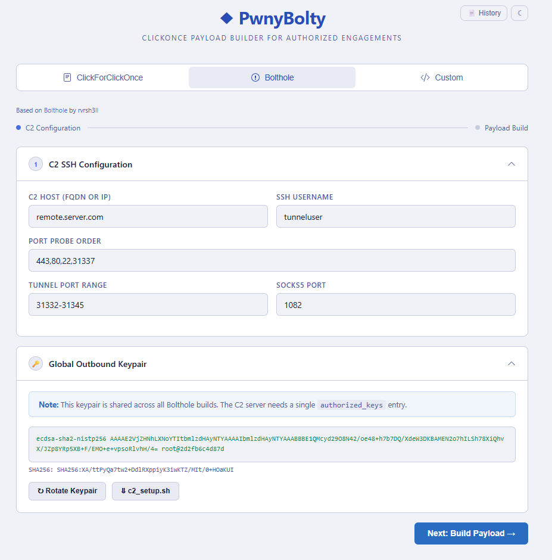

Before building, save your C2 details so PwnyBolty can generate and store the global outbound keypair. This keypair is reused across all Bolthole builds so your C2 only needs one `authorized_keys` entry.

| Field | Example | Notes |
|-------|---------|-------|
| **C2 Host** | `remote.server.com` | FQDN or IP of your C2 VPS |
| **SSH Username** | `tunneluser` | Restricted user created by `c2_setup.sh` |
| **Port Probe Order** | `443,80,22,31337` | Ports tried in order; first that connects wins |
| **Tunnel Port Range** | `31332-31345` | Each victim gets a unique port in this range |
| **SOCKS5 Port** | `1082` | SOCKS5 proxy port bound on C2 |

Once saved, the **Global Outbound Keypair** is generated and displayed. Download `c2_setup.sh` and run it once on your C2 server to create the restricted SSH user and configure `authorized_keys`. Use **Rotate Keypair** to cycle to a new keypair if the key is ever compromised (requires re-running `c2_setup.sh`).

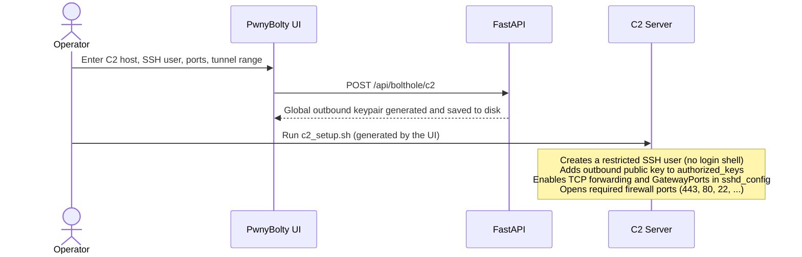

### Payload Build

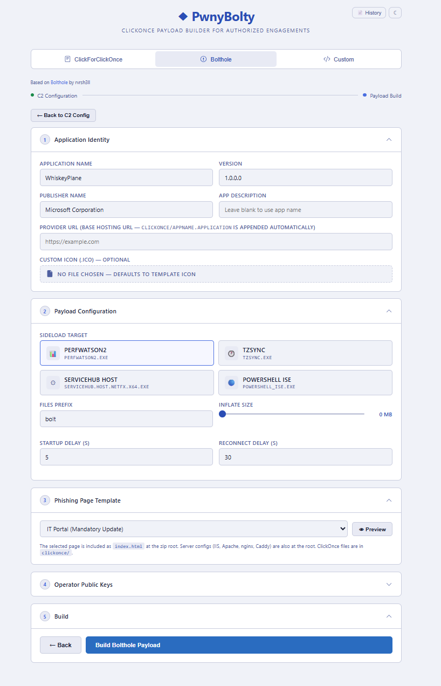

After saving C2 config, click **Next: Build Payload →** to reach the build form. Configure the following, then click **Build Bolthole Payload**:

| Section | What to configure |
|---------|------------------|
| **1 Application Identity** | App name, version, publisher name, provider URL (base hosting URL) |
| **2 Payload Configuration** | Sideload target; **Files Prefix** (default `bolt` → `boltd.exe`, `boltcon.exe`…); inflate size; startup delay (s); reconnect delay (s) |
| **3 Phishing Page Template** | HTML lure page included as `index.html` in the zip |
| **4 Operator Public Keys** | Optional: paste additional operator public keys to embed in `authorized_keys` |
| **5 Build** | Click **Build Bolthole Payload** to start the background build |

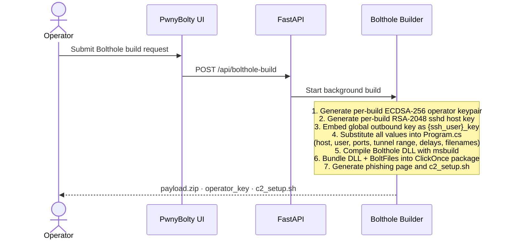

### Build Logs and Artifacts

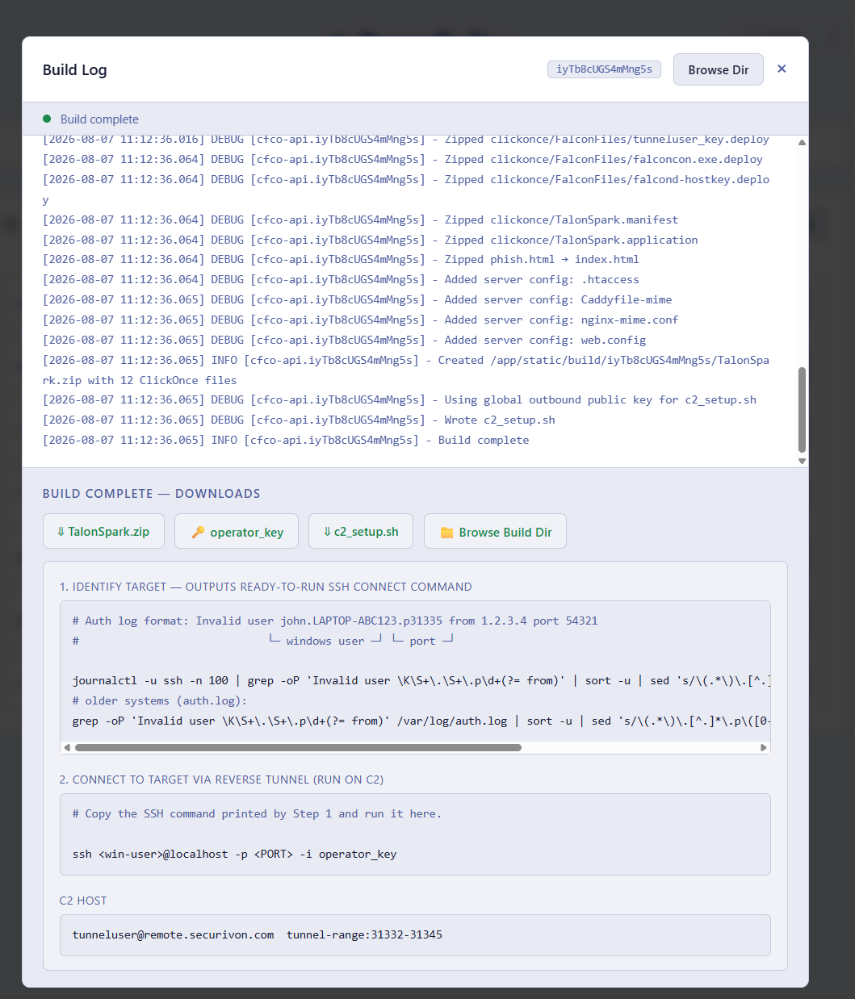

Click the **Log** button on any build in History (or wait for the modal to appear after clicking **Build Bolthole Payload**) to see the real-time build log. When the build finishes, the modal shows:

**Download buttons:**

| Artifact | Description |
|----------|-------------|
| `<name>.zip` | Full ClickOnce package — host this on your server and send the phishing link |
| `operator_key` | Per-build ECDSA private key — keep this; it's the only copy |
| `c2_setup.sh` | Script to configure your C2 server (only needed once per C2 host) |
| **Browse Build Dir** | Opens the raw build directory listing for all files |

**Post-build operator steps (shown in the modal):**

1. **Identify the target's tunnel port** — grep the C2 SSH auth log for the `Invalid user` entry that encodes `<winuser>.<machine>.p<PORT>`:
   ```bash
   journalctl -u ssh -n 100 | grep -oP 'Invalid user \K\S+\.\S+\.p\d+(?= from)'
   # older systems:
   grep -oP 'Invalid user \K\S+\.\S+\.p\d+(?= from)' /var/log/auth.log
   ```
2. **Connect via the reverse tunnel** — copy the SSH command printed by step 1:
   ```bash
   ssh <win-user>@localhost -p <PORT> -i operator_key
   ```

**Build History** — the History panel lists all past builds with their timestamp, name, build ID, status, log, and download links:

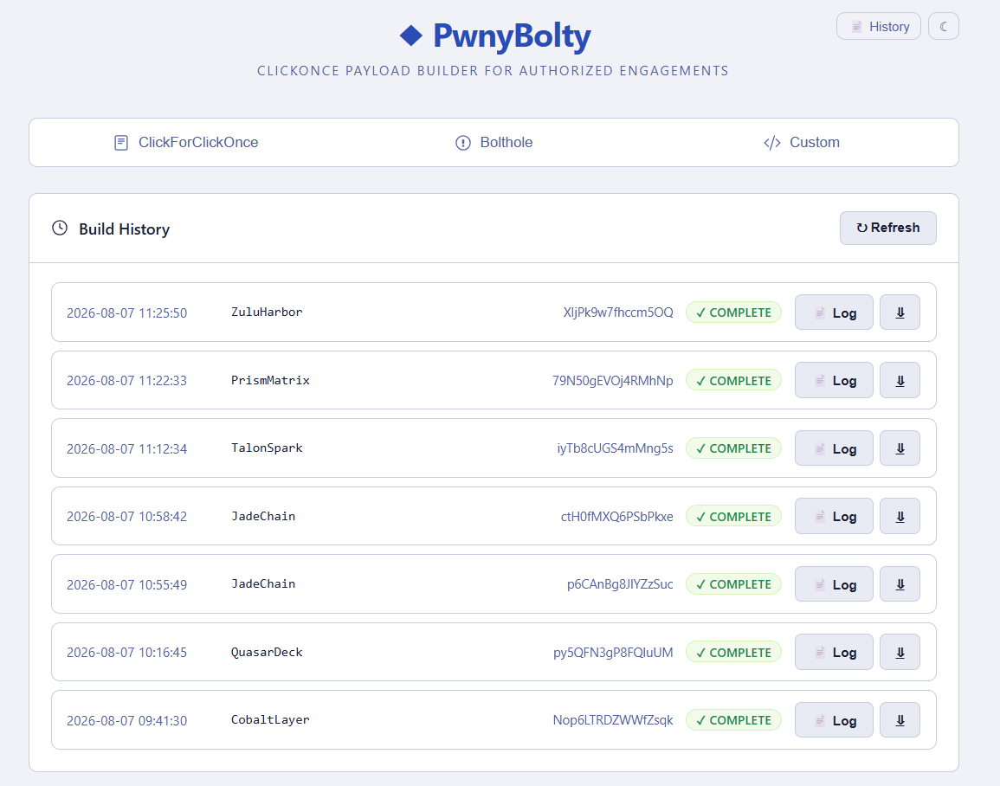

**BoltFiles** — binaries embedded in the ClickOnce package and extracted to a temp directory on the target:

| File | Role |
|------|------|
| `sshd.exe` | Miniature SSH daemon — listens on `127.0.0.1:<tunnel_port>` |
| `ssh.exe` | SSH client — connects outbound to C2, creates the reverse tunnel |
| `libcrypto.dll` | Crypto library required by sshd/ssh |
| `sshd-hostkey` | Per-build RSA-2048 host key for sshd (unique per deployment) |
| `sshd-config` | SSH daemon config (port, listen address, auth settings) |
| `authorized_keys` | Per-build operator public key (who can SSH into the tunnel) |
| `{ssh_user}_key` | Global outbound private key (ssh authenticates to C2 with this) |

> **Files prefix** — the filenames above use the default prefix `bolt` (`boltd.exe`, `boltcon.exe`, `boltd-hostkey`, etc.). You can change this from the UI under **Files Prefix** before building. For example, setting it to `shadow` produces `shadowd.exe`, `shadowcon.exe`, `shadowd-hostkey`, and so on — useful for blending into the target environment.

### Step 3 — Delivery and tunnel establishment

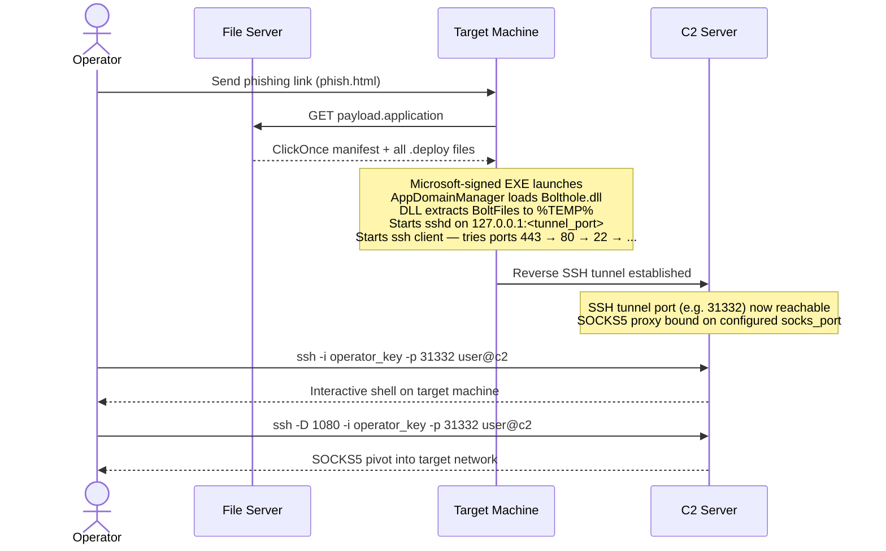

> **How the operator finds the tunnel port:** When the target connects, the SSH client uses the Windows username and machine name as the SSH username in the format `<user>.<machine>.p<PORT>`. The C2 auth log shows this: `journalctl -u ssh | grep "Invalid user"`. The `.p<PORT>` suffix is the active tunnel port.

### Tunnel Architecture

Once the payload runs, the live network looks like this:

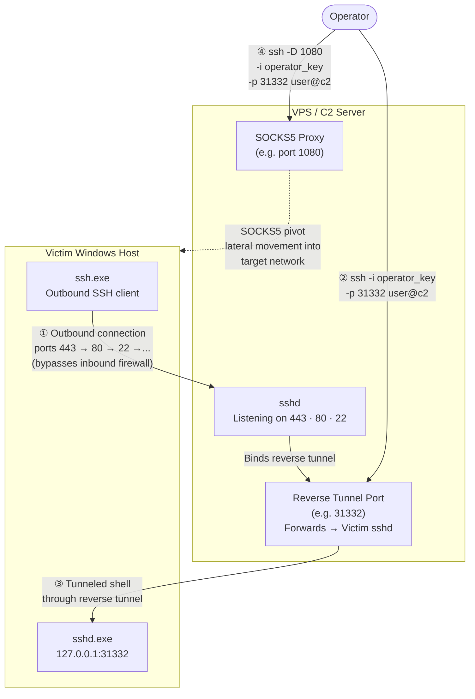

| Step | What happens |
|------|-------------|
| ① | Victim's `ssh.exe` calls home through whichever port the firewall allows (443 → 80 → 22 …) |
| ② | Operator SSHes into the C2 on the dynamically assigned tunnel port to get a shell |
| ③ | The C2 forwards the connection through the reverse tunnel to the victim's local `sshd` |
| ④ | Operator opens a SOCKS5 proxy through the same tunnel for lateral movement into the target network |

---

## Mode 3 — Custom Build

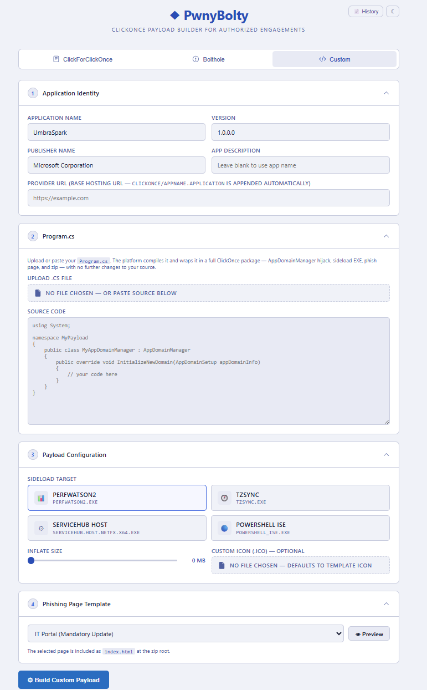

The **Custom** tab lets you bring your own `AppDomainManager` C# source. PwnyBolty compiles it and wraps it in the same ClickOnce delivery package — AppDomainManager hijack, sideload EXE, phishing page, and zip — without touching your source code.

| Section | What to configure |
|---------|------------------|
| **1 Application Identity** | App name, version, publisher name, provider URL |
| **2 Program.cs** | Upload a `.cs` file or paste source directly into the editor. The class must inherit from `AppDomainManager` and override `InitializeNewDomain`. |
| **3 Payload Configuration** | Sideload target; inflate size; optional custom `.ico` icon |
| **4 Phishing Page Template** | HTML lure page template |

**Minimal `Program.cs` skeleton:**
```csharp
using System;

namespace MyPayload
{
    public class MyAppDomainManager : AppDomainManager
    {
        public override void InitializeNewDomain(AppDomainSetup appDomainInfo)
        {
            // your code here
        }
    }
}
```

Click **Build Custom Payload** to compile and package. The resulting zip is downloaded from the same History panel as all other builds.

---

## Payload Encryption

Shellcode and dropped files are encrypted by the `Mutator` class before being written to `config.json`. The binary format is self-describing — the DLL reads the header to know which algorithm to use and how large each field is.

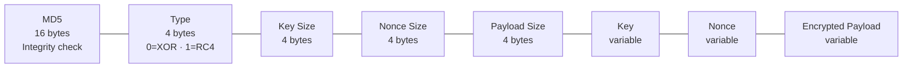

| Field | Detail |
|-------|--------|
| **MD5** | Hash of the plaintext — verified after decryption to detect corruption |
| **Type** | Chooses XOR (key-repeating) or RC4 (PRGA) at runtime |
| **Key / Nonce** | Random alphanumeric bytes, 16–32 bytes in length, chosen per build |
| **Encrypted Payload** | Raw shellcode or file bytes encrypted with the chosen algorithm |

**Inflation** — encrypted blobs can be padded to 50 MB (40% random noise + 60% null bytes) to push past EDR size-scan thresholds.

**API hash resolution** — `ntdll.dll` and `LdrCallEnclave` are resolved at runtime using HMAC-MD5 with a random 64-bit key baked in per build, so no function names appear in the import table.

---

## Key Terms

| Term | Meaning |
|------|---------|
| **ClickOnce** | Microsoft deployment technology that installs and runs .NET apps from a URL — no installer needed |
| **AppDomainManager hijack** | A `.config` file alongside the EXE redirects the .NET runtime to load a custom DLL as the AppDomainManager, giving code execution inside a trusted process |
| **Sideloading** | Loading a custom DLL by placing it next to a legitimate signed binary that will load it automatically |
| **sshd** | Minimal SSH daemon bundled in the package, runs locally on the target |
| **ssh** | SSH client bundled in the package, connects outbound from target to C2 |
| **Reverse SSH tunnel** | The target initiates the outbound connection (bypassing inbound firewall rules); the operator connects inbound through that tunnel |
| **SOCKS5 pivot** | SSH dynamic port forwarding that lets the operator route arbitrary TCP traffic through the tunnel into the target network |
| **Operator keypair** | Per-build ECDSA keypair — private key goes to the operator, public key is embedded in `authorized_keys` inside the package |
| **Global outbound keypair** | Shared ECDSA keypair used by the SSH client to authenticate to C2 — one entry in the C2's `authorized_keys` covers all builds |
