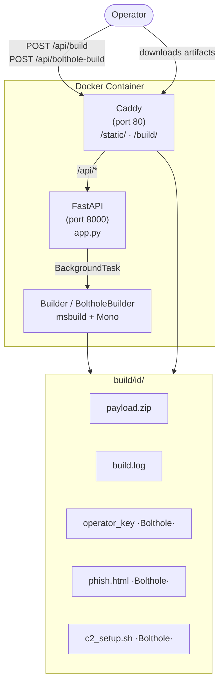
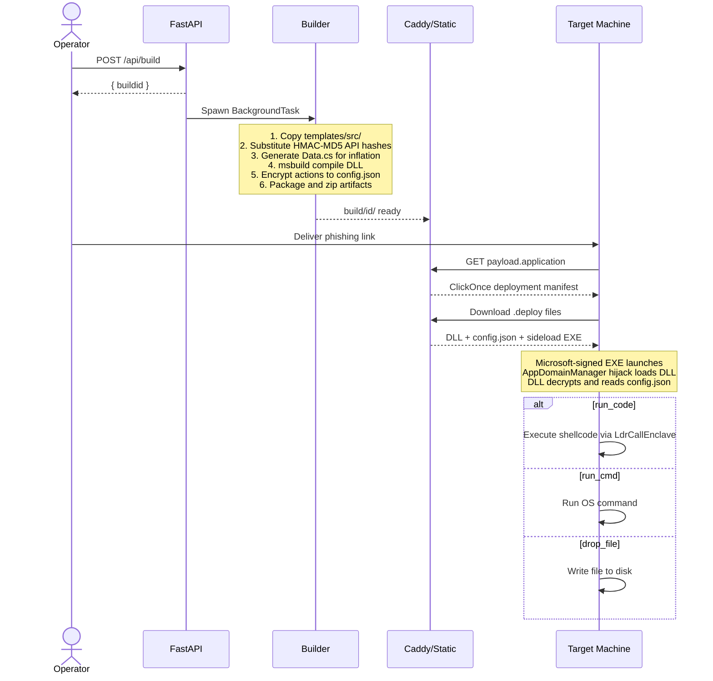
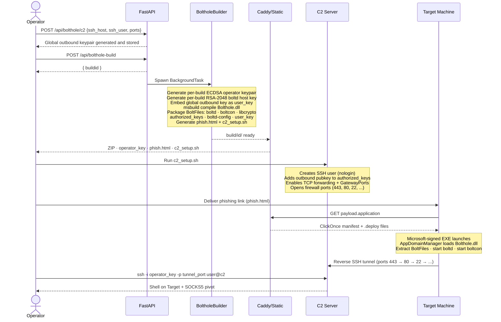
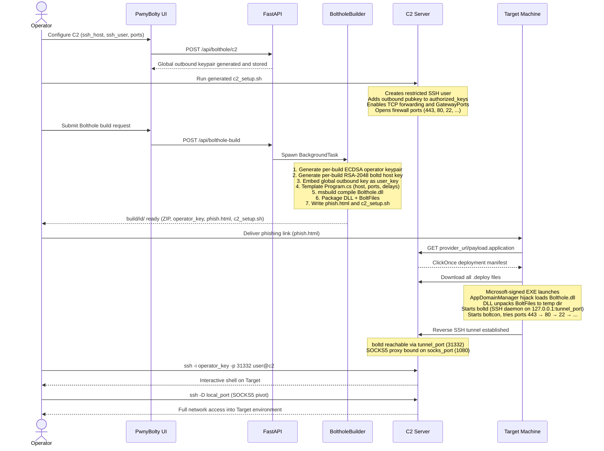
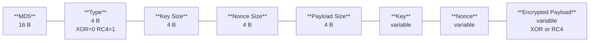

# PwnyBolty — Technical Wiki

---

## Architecture

---

## CFCO Build Flow

---

## Bolthole Build Flow

---

## Bolthole Sequence

---

## Payload Encryption

Shellcode and dropped files are encrypted by `Mutator` before embedding. Each encrypted blob has the following binary layout:

- **MD5** — integrity check of the plaintext payload before encryption
- **Type** — selects the decryption algorithm at runtime (`0` = XOR, `1` = RC4)
- **Key / Nonce** — random alphanumeric bytes, length chosen randomly between 16–32 bytes per build
- **Encrypted Payload** — XOR key-repeating or RC4 PRGA over the raw shellcode/file bytes
- **Inflation** — optionally padded to 50 MB with random noise + null bytes to further hinder scanning

API exports (`ntdll.dll`, `LdrCallEnclave`) are resolved at runtime using HMAC-MD5 hashes with a random 64-bit key baked in per-build, avoiding static import table entries.
